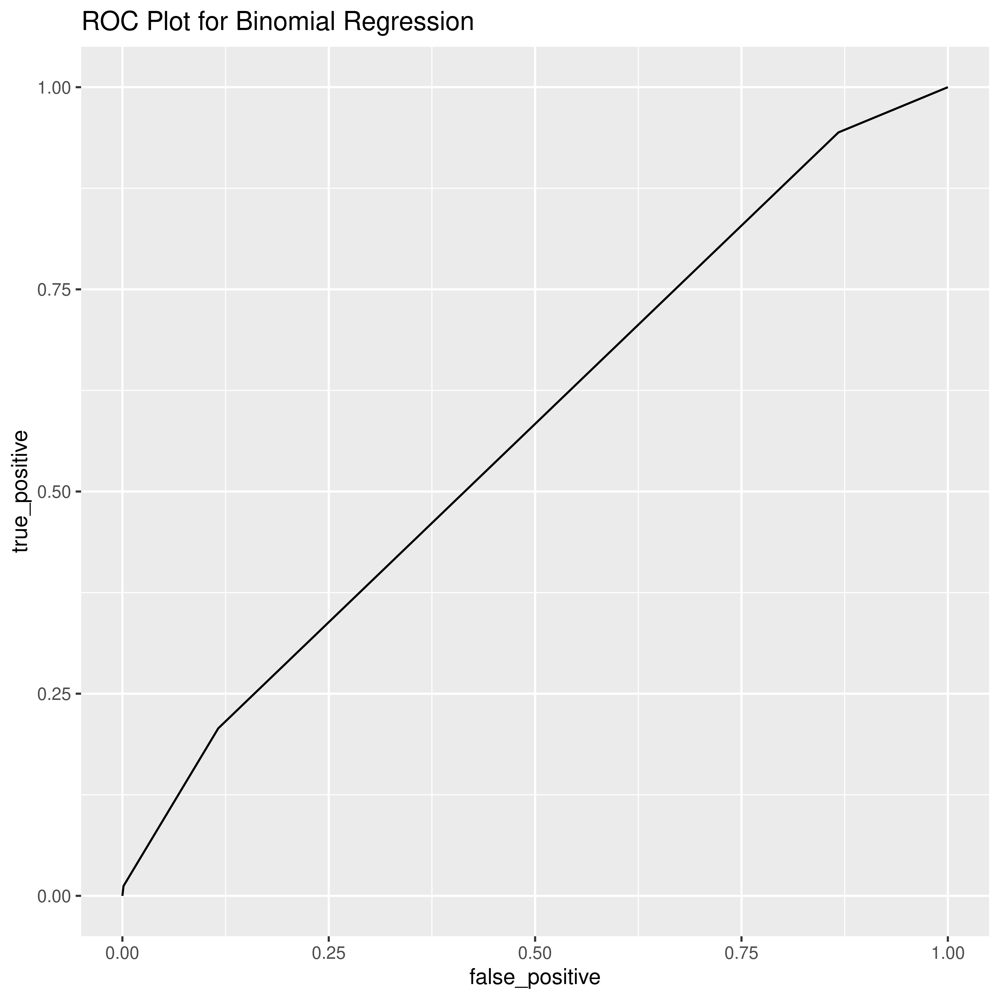

# First Moves

The distribution of the first moves Carlsen plays as White compared to those who play against him is as follows:

We can see that, as expected, the moves `d4` and `d5` are the most common, as these moves are usually excellent ways to take control of the board's center and to prepare piece development. However, Carlsen clearly has a knack for playing the unusual moves `c4` and `g4` in the opening as White, and also plays `Nc3` sometimes which seems to be a move other players almost avoid entirely. Carlsen is known for trying to take players out of their theoretical comfort zone by playing unusual openings. We will explore the full opening reportoire Carlsen utilizes later.

The disitribution of first moves as Black looks as follows:

Here we also see solid defense moves such as `d5` and `Nf6` topping the list, specially as these two moves lead to good defenses against `e4` and `e5` by White. Carlsen also stands out here for his usage sometimes of unconventional Black opening moves such as h5 and b5 (he is almost unique in playing h5, which is theoretically a bad response to any white opening). 

# Opponent Elo and Winning Prediction

To see if there is a correlation between oponent rating and Carlsen winning a game, I first filtered the data to only include Elo scores above 2000. This is because some extremely strong players may not play regularly on Lichess and therefore may start accounts only to play a specific event. This would skew their rating as they would have the initial rating the site gives to a new user and would not reflect their true strength. By filtering for Elo larger than 2000, we ensure that the score more likely reflects the players' true strength.

Prediction is done using a binomial regression model, with 30% of the data being set aside for testing. The resulting ROC curve on the testing data set is this:

It seems that the model is barely better than a random guess, and so surprisingly Carlsen's opponent's rating does not predict whether Carlsen will win the game or not. This will be later broken down by gametype and by whether the opponent is titled or not to further test any correlations.
