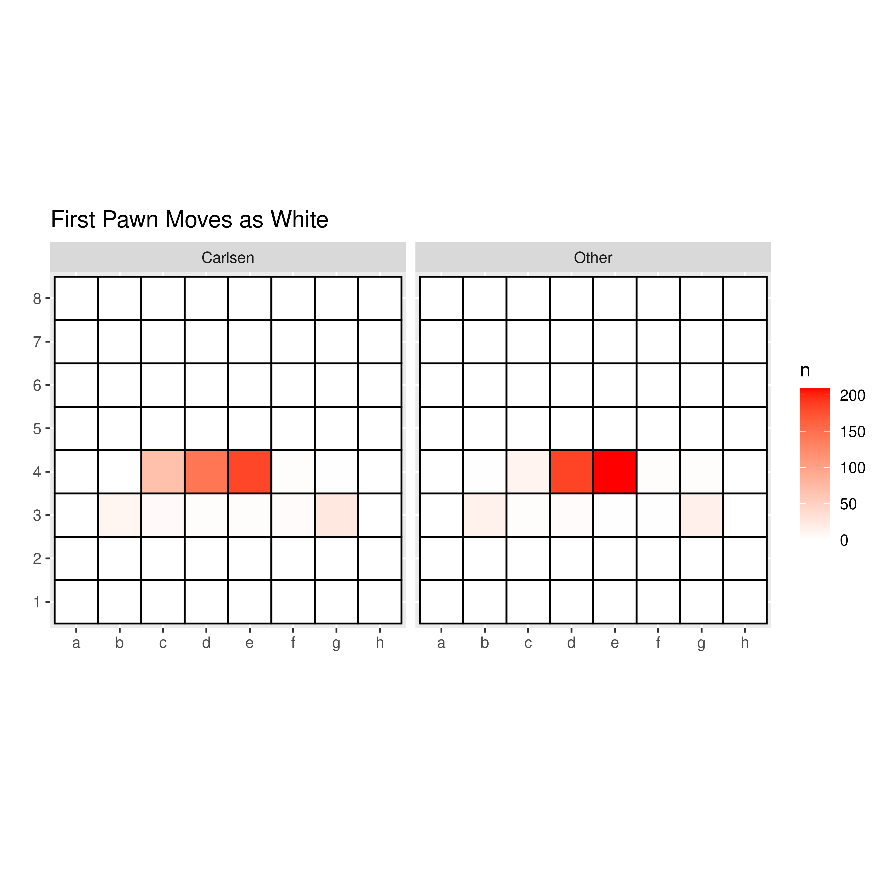
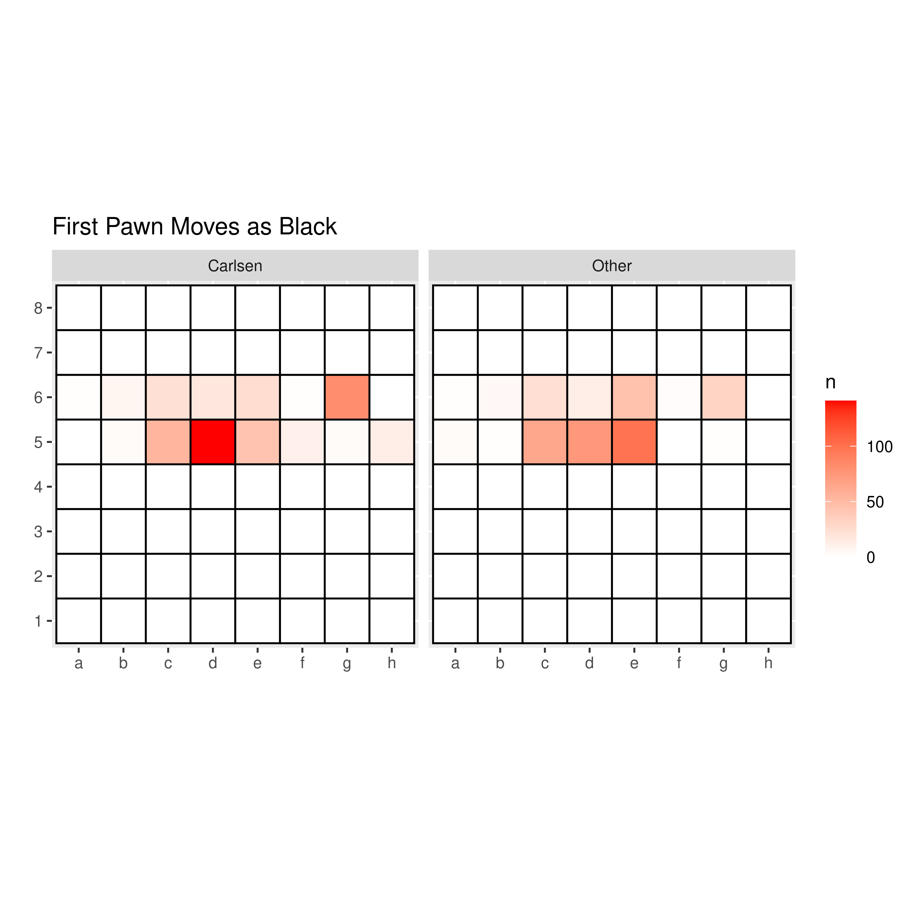
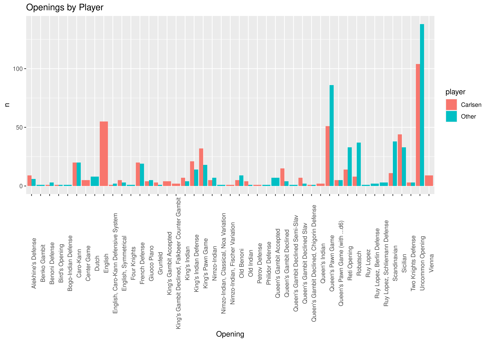
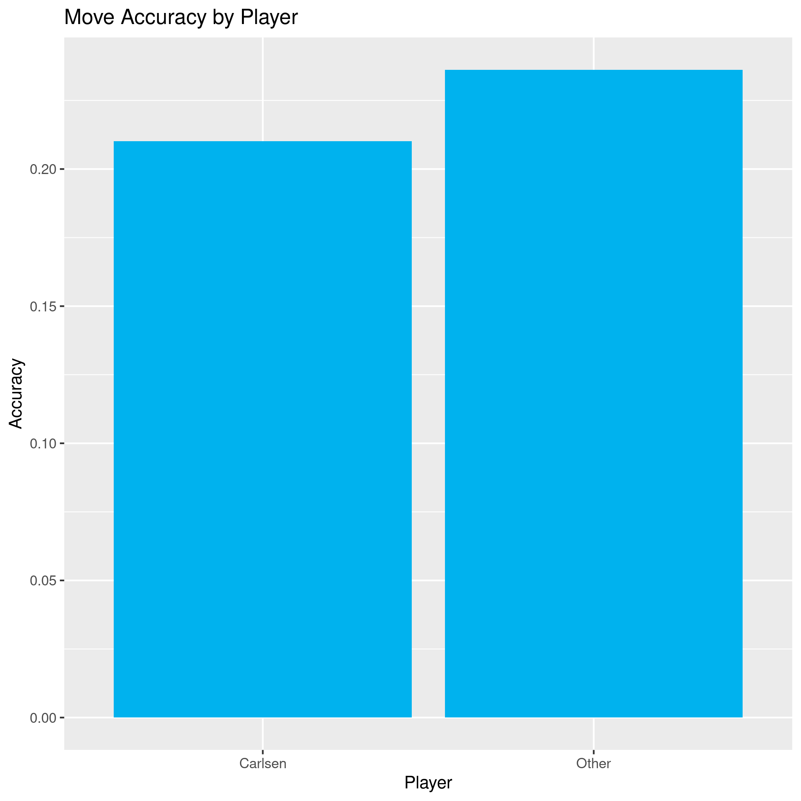

# First Moves

The distribution of the first moves Carlsen plays as White compared to those who play against him is as follows:

We can see that, as expected, the moves `d4` and `d5` are the most common, as these moves are usually excellent ways to take control of the board's center and to prepare piece development. However, Carlsen clearly has a knack for playing the unusual moves `c4` and `g4` in the opening as White, and also plays `Nc3` sometimes which seems to be a move other players almost avoid entirely. Carlsen is known for trying to take players out of their theoretical comfort zone by playing unusual openings. We will explore the full opening reportoire Carlsen utilizes later.

The disitribution of first moves as Black looks as follows:

Here we also see solid defense moves such as `d5` and `Nf6` topping the list, specially as these two moves lead to good defenses against `e4` and `e5` by White. Carlsen also stands out here for his usage sometimes of unconventional Black opening moves such as h5 and b5 (he is almost unique in playing h5, which is theoretically a bad response to any white opening). 

# Openings

Comparing the first few openings moves to a list of known openings for Carlsen and other players we get the following opening distribution:

We can see here that when Carlsen is playing Black, other players are more likely to wander into uncommon openings than the other way around. This is an idicator of Carlsen's tendency to try and take players out of their theoretical openings when he is defending as Black, or of other players trying to avoid familiar openings knowing Carlsen's strong theoretical knowledge. We can also see that Carlsen prefers the English opening as white markedly more than other players and he also plays the Scandinavian defense as Black more often than his opponents. Both of these are openings that Carlsen is known for.

# Opponent Elo and Winning Prediction

To see if there is a correlation between oponent rating and Carlsen winning a game, I first filtered the data to only include Elo scores above 2000. This is because some extremely strong players may not play regularly on Lichess and therefore may start accounts only to play a specific event. This would skew their rating as they would have the initial rating the site gives to a new user and would not reflect their true strength. By filtering for Elo larger than 2000, we ensure that the score more likely reflects the players' true strength.

Prediction is done using a binomial regression model, with 30% of the data being set aside for testing. The resulting ROC curve on the testing data set is this:

It seems that the model is barely better than a random guess, and so surprisingly Carlsen's opponent's rating does not predict whether Carlsen will win the game or not. This could possibly be further broken down by gametype and by whether the opponent is titled or not to test any other possible correlations.

# Move Accuracy Analysis

Stockfish is the best known available Chess engine today (Google's AlphaZero has shown potential to surpass Stockfish, however it is not publicly available for game analysis). I analyze a sample of 25 games from this database to test how often the players play the top engine move at any given point. The resulting accuracy metric is therefore the fraction of moves by the player that correspond to the top engine selection. 

We can see that for this sample, Carlsen's accuracy is lower than his opponent. The caveats here is that this is only a sample of 25 games out of thousands, and that this accuracy is only based on a low depth analysis since higher depth analysis would take even more time. Depth in this case refers to the number of moves ahead the engine is looking at. Given the super exponential growth in the number of possible positions that occurs with move depth, higher depth analyses becomes rapidly more computationally expensive. Another caveat here is that opening theory often does not correspond with engine preferences, and so opening heavy games may be skewing the results against Carlsen.  
